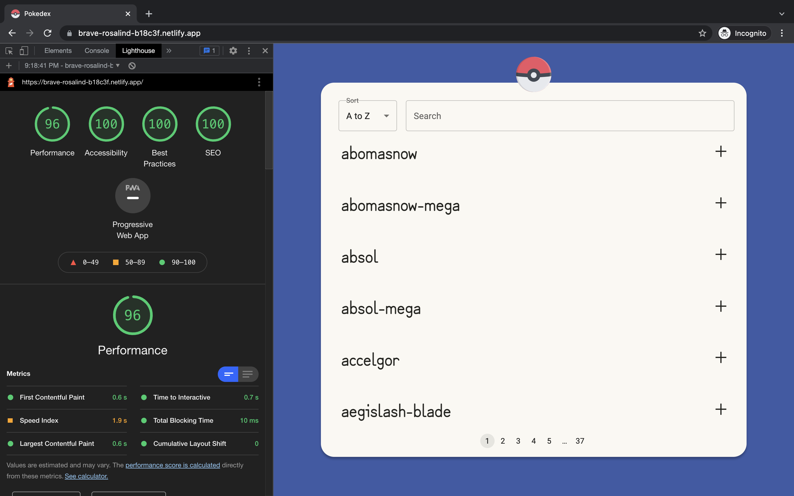

# underdog-fantasy-assessment-pokedex

<br />

<a href='https://brave-rosalind-b18c3f.netlify.app/' target='_blank' rel='noopener noreferrer'>DEPLOYED APP</a>

<br />

---

<br />

## Table of Contents

<br/>

> - [Title](#title--repository-name)
> - [Table of Contents](#table-of-contents)
> - [Objective](#objective)
> - [Installation](#installation)
> - [Usage](#usage)
> - [Demo](#demo)
> - [Lighthouse](#lighthouse)
> - [Author](#author)
>   - [Contact](#contact)
> - [Packages](#packages)
> - [License](#licenses)

<br />

---

<br />

## Objective

The objective was to create a simple app, displaying a list of 25 Pokemon per page with the ability to select specific Pokemon to reveal more information about them.

We've also added the functionality to search by name and sort alphabetically both ascending and descending.

An API return of a single Pokemon can be previewed <a href='https://pokeapi.co/api/v2/pokemon/201/' target='_blank' rel='noopener noreferrer'>here</a> .

<br />

---

<br />

## Installation

This is a react app, built with `create-react-app` so once you've cloned, you'll need to run the following command from the root directory to install all necessary dependencies.

```
cd client/ && npm i
```

<br />

---

<br />

## Usage

Once dependencies have been installed, you can run the following command from the root directory to start the application at `http://localhost:3000`

```
cd client/ && npm start
```

If you've already navigated to the client directory, simply run `npm start`.

<br />

---

<br />

## Demo


<br />

---

<br />

## Lighthouse



<br />

---

<br />

## Author

<br />

### Yoni David

<br />

- <a href='https://yondav.us/'>Portfolio</a>
- <a href='https://github.com/yondav'>Github</a>

<br />

---

<br />

### Contact

<br />

Inquiries can be sent to [yoni@yondav.com](mailto:yoni@yondav.com)

<br />

## Packages

<br />

- [Axios](https://www.npmjs.com/package/axios)
- [React-ChartJS-2](https://www.npmjs.com/package/react-chartjs-2)
- [Framer-Motion](https://www.framer.com/motion/)
- [React-Icons](https://react-icons.github.io/react-icons)
- [Material-UI](https://mui.com/)
  <br />

## Licenses

<br />

- [MIT](https://github.com/yondav/21-google-books-search/blob/main/LICENSE)

<br />

  <p align='center'>Copyright &copy; 2021, Yoni David<p>
